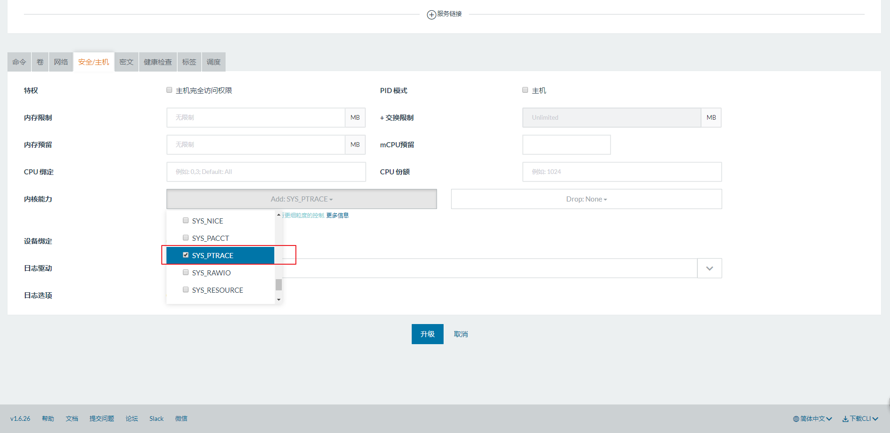

# 常见问题

## 1. Docker 中无法使用 JDK jmap之 Can't attach to the process: ptrace(PTRACE_ATTACH问题

问题分析：这不是什么 docker 或者jmap的Bug，而是 Docker 自 1.10 版本开始加入的安全特性。 jmap 这类 JDK 工具依赖于 Linux 的 PTRACE_ATTACH，而 Docker 自 1.10 版本开始，默认的 seccomp 配置文件中禁用了 ptrace

解决办法：

* 直接关闭 seccomp 配置或者将ptrace添加到允许的名单中。用法：

  ```shell
  docker run --security-opt seccomp:unconfined ...
  ```

* 使用 --cap-add 明确添加指定功能：

  ```shell
  docker run --cap-add=SYS_PTRACE ...
  ```

* Docker Compose 的支持

  ```shell
  version: '2'
  
  services:
    mysql:
      ...
    api:
      ...
      cap_add:
        - SYS_PTRACE
  ```

  [官方连接]: https://docs.docker.com/compose/compose-file/compose-file-v2/#cap_add-cap_drop	"官方连接"

* Rancher 解决办法

  
